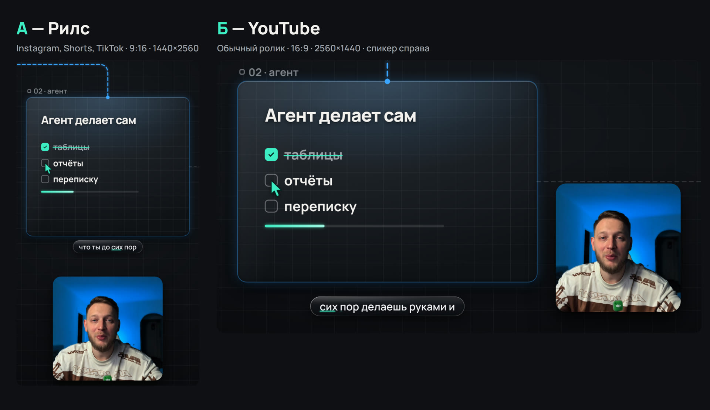

# Reels Pipeline · Автомонтаж

> **Агенту (Claude Code, Codex), которому дали ссылку на этот репозиторий:** склонируй, подготовь всё по
> [SETUP.md](SETUP.md) (ставишь сам, человеку в терминал ничего не давай), а когда всё готово — **сразу начни опрос владельца**
> по [docs/agent-contract/WORKFLOW.md](docs/agent-contract/WORKFLOW.md): модель и усилие → **рилс или ролик для YouTube**
> (покажи картинкой `reference/style-previews/formats.jpg`) → **стиль монтажа** (картинка `reference/style-previews/styles.jpg`,
> [knowledge/montage-concepts.md](knowledge/montage-concepts.md)) → вопросы по одному. Монтаж — на Remotion + Storybook в `studio/`,
> рендер — только после «да» владельца на листы кадров. В Claude Code весь путь запускается командой `/reel`.

**[onAI Academy](https://onai.academy)** · автор **[@saint4ai](https://instagram.com/saint4ai)**

Производственный пайплайн монтажа роликов с AI-агентом: **рилсы 9:16** и **ролики для YouTube 16:9** в 2K, 60 fps.
Рендер — [Remotion](https://remotion.dev) (сцены — React-компоненты, анимация от номера кадра), витрина блоков —
[Storybook](https://storybook.js.org), дизайн-система с глубиной и жидким стеклом. Собран на реальном производстве:
на нём смонтированы последние ролики @saint4ai.

[Блог](https://onai.academy/blog/) · [Instagram](https://instagram.com/saint4ai) · [Telegram](https://t.me/strogo_na_opuse)

> **Пришли из рилса?** Пошаговый старт — [START.md](START.md): отдаёшь ссылку Claude, он ставит всё сам и сразу ведёт по вопросам.

---

## Как это работает

Агент не монтирует «как получится». Он ведёт владельца по этапам и на каждом ждёт ответа:

1. **Формат** — рилс или YouTube.
2. **Стиль** — один из четырёх по настоящим кадрам или свой под ролик.
3. **Опрос** по одному вопросу — тема, текст, запись, материалы, референсы, сдача.
4. **Текст** — ресёрч с источниками, черновик и три независимых скептика.
5. **Монтаж** — своя карта монтажа под текст, сборка в студии, каждый блок сначала принимается в Storybook.
6. **Кадры** — листы каждые 2 секунды с номерами, правки словами.
7. **Рендер** 2K, 48 Мбит/с, громкость −14 LUFS.




| Стиль | Механика |
|---|---|
| **1 — КАНВАС** | один холст, карточки блоков, камера едет по пунктиру за курсором ИИ-агента, клики по пунктам |
| **2 — СТЕКЛО** | Liquid Glass с настоящим преломлением, свет, капсулы, стеклянные 3D-предметы |
| **3 — ПОСТЕР** | огромная типографика, цветные заливки, штрихкоды, один стеклянный предмет на блок |
| **4 — СЦЕНЫ** | фон меняется каждые 3–7 с: портал, размытие в цвет, свечение, рывок, телефон, тогл |

## Студия

```bash
cd studio && npm ci && npx remotion browser ensure     # ставит агент
npm run studio                                         # студия Remotion
npm run storybook                                      # витрина блоков
bash ../scripts/new-video.sh my-video reels запись.mp4 # новый ролик: запись, расшифровка, заготовка
ENTRY=src/videos/my-video/index.tsx node scripts/review.mjs my-video   # листы кадров каждые 2 с
npx remotion render src/videos/my-video/index.tsx my-video ../videos/my-video/renders/raw.mp4
bash scripts/master.sh ../videos/my-video/renders/raw.mp4 ../videos/my-video/renders/final.mp4
```

| Папка | Что внутри |
|---|---|
| `studio/src/formats.ts` | два формата: зона графики, три размера карточки спикера, субтитры |
| `studio/src/template/` | шаблон КАНВАС: хук, список с галочками, цифра, логотипы, призыв; стол, пунктир, камера, курсор |
| `studio/src/kit/` | библиотека: стекло с преломлением, постер, переходы сцен, 3D, телефон, тогл, иллюминатор |
| `studio/src/ds/` | глубина текста и панелей, токены, проверка контейнеров |
| `studio/src/stories/` | витрина Storybook |
| `studio/public/` | шрифты, звуки, логотипы сервисов, стеклянные предметы |
| `.claude/skills/remotion-montage/` | правила кадра, проверки и грабли для агента |
| `docs/agent-contract/WORKFLOW.md` | этапы и стоп-точки |

## Проверки до рендера

- `npm run typecheck` — типы.
- `node scripts/qa-fit.mjs <композиция>` — каждые 0,5 с рендерит кадр и ловит тексты, которые не влезли в контейнер или прижаты
  к краю → `FIT PASS`. `node scripts/qa-fit.mjs FitTest` обязан падать — это доказательство, что проверка жива.
- Листы кадров каждые 2 с владельцу и самому агенту: наложения, пустой фон после стыка, метка курсора поверх текста.
- После рендера — лист из самого MP4, размер, битрейт и громкость.

## История: экономия токенов (замеры на HyperFrames-пайплайне)

До перехода на Remotion репозиторий монтировал на HyperFrames, и там мы померили, куда уходят токены агента. Замеры и приёмы
работают для любого стека; инструменты `scripts/pipe.py` остались для старых проектов — [docs/legacy-hyperframes.md](docs/legacy-hyperframes.md).

### Что это решает

Агент, монтирующий видео, сжигает подписку быстрее, чем успевает выпустить ролик.
Мы померили, куда именно уходят токены, и построили слой, который это чинит.

| Статья расхода | Эквивалент за сессию | Доля |
|---|---:|---:|
| Параллельные субагенты (31 штука) | 16 854 197 | **74,5 %** |
| Выход модели (797k × 5) | 3 990 000 | 17,6 % |
| Перечитывание контекста (28,98 млн × 0,1) | 2 898 000 | 12,8 % |
| Чтение всех файлов проекта | ≈ 70 000 | **0,3 %** |

Чтение файлов — последняя статья, а не первая. Разница с первой в двести сорок раз.
Методика и чек-лист внедрения — [docs/checklist.md](docs/checklist.md).

### Главный приём: агент спрашивает, а не читает

```bash
python3 scripts/pipe.py scenes videos/my-project
```

```
COMPOSITION legal-ai-pilot 1080x1920 @30fps dur=39.83s  [index.html, 60195 байт]
    0.00+39.83  video #speaker-video     src=source-clip.mp4 tweens=0
    1.37+2.59   audio #sfx-impact        src=sfx_001.mp3 tweens=0
   19.05+1.62   audio #sfx-error         src=sfx_003.mp3 tweens=0
  CAPTIONS x30  0.05..39.83s   → pipe.py captions
  ANIM #phase-hook:3, .hook-shake:3, #phase-process:3, #phase-evidence:3
```

**1 099 байт вместо 60 195.** По таймингам и структуре не потеряно ничего.

| Композиция | Целиком | Через `pipe` | |
|---|---:|---:|---:|
| Подкаст-рилс | 60 195 б | 2 403 б | **25×** |
| Экспертный рилс | 95 555 б | 2 770 б | **34×** |

### Три закона фильтрации

Ценность не в скриптах, а в правилах. Под ваш стек скрипты будут другими, законы те же.

**1. У каждой команды есть байтовый потолок.** При превышении вывод обрезается с явным
маркером: сколько выброшено и чем достать. Молчаливого усечения не бывает — тихая обрезка
хуже отсутствия данных, потому что агент считает, что видел всё.

**2. Лестница важности.** `[BLOCKING]` — дословно и сразу. `[ACTIONABLE]` — одной строкой
с указателем. `[INFO]` — только в `logs/`, в разговор не попадает никогда.

**3. Проекция, а не пересказ.** Пересказ теряет информацию непредсказуемо. Проекция —
точный вид на явно выбранное подмножество, поэтому всегда видно, чего ты не видишь.

## База знаний

Принципы монтажа и текста не зависят от стека. Раскладки и размеры в них — старого формата 1080×1920; для новых роликов
числа берутся из `studio/src/formats.ts`.

| Файл | Что внутри |
|---|---|
| [knowledge/01_catalog.md](knowledge/01_catalog.md) | 62 приёма анимации: механика, когда уместен |
| [knowledge/02_editing.md](knowledge/02_editing.md) | Принципы монтажа: ритм, склейки, адаптивные раскладки |
| [knowledge/03_rules.md](knowledge/03_rules.md) | Смысл фразы → приём, плотность вставок, цветовой код |
| [knowledge/04_pipeline.md](knowledge/04_pipeline.md) | Рендер, субтитры, ffmpeg, шрифты, safe-zone |
| [knowledge/05_pitfalls.md](knowledge/05_pitfalls.md) | Грабли, на которых уже наступали |
| [knowledge/06_copywriting.md](knowledge/06_copywriting.md) | Хуки, структура, связка текста с подсветкой |
| [knowledge/07_production_system.md](knowledge/07_production_system.md) | Полный production playbook |

Начинать — с [CONTEXT.md](CONTEXT.md), это входная дверь для агента.
История решений и забракованных подходов — в [history/](history/).

### QA без рендера (старые проекты)

| Скрипт | Что делает |
|---|---|
| [scripts/face-caption-clearance.py](scripts/face-caption-clearance.py) | OpenCV-траектория лица и проверка, что субтитр не сел на подбородок. Без полного рендера |
| [scripts/check-reels-safe-zone.sh](scripts/check-reels-safe-zone.sh) | Proof-кадры с safe-zone оверлеем, master не трогается |
| [reference/platform-guides/](reference/platform-guides/) | Реальные safe-zone Instagram Reels и TikTok, адаптивные позиции субтитров |

Один кадр, показанный модели, стоит около 1500 токенов — дороже всего вывода линтера.
Поэтому QA возвращает вердикт текстом, а кадры остаются на диске.

## Авторство

Автор метода и реализации — **onAI Academy**, [@saint4ai](https://instagram.com/saint4ai).

Лицензия MIT: используйте, изменяйте, встраивайте в свои проекты, в том числе коммерческие.
Единственное условие — сохраняйте [LICENSE](LICENSE) и [NOTICE](NOTICE) в производных работах
и не выдавайте метод за собственную разработку. Подробности — в [NOTICE](NOTICE).

Метки происхождения `origin=onai-rpa-2026-09` и `spec=three-laws/v1` встроены в заголовки
скриптов и в константы `pipe.py`. Проверить: `python3 scripts/pipe.py --about`.

## Чего здесь нет

Записи владельца, готовые рендеры и стоковая библиотека переходов в репозиторий не входят (записи ролика лежат
в `studio/public/projects/`, эта папка в `.gitignore`). Ключей, токенов и доступов здесь нет — ни в дереве, ни в истории:
`bash scripts/check-secrets.sh --history`, см. [SECURITY.md](SECURITY.md). Лицензии заимствованного —
[THIRD_PARTY_NOTICES.md](THIRD_PARTY_NOTICES.md).

---

**onAI Academy** · [onai.academy](https://onai.academy) · [@saint4ai](https://instagram.com/saint4ai) · [Telegram](https://t.me/strogo_na_opuse)
